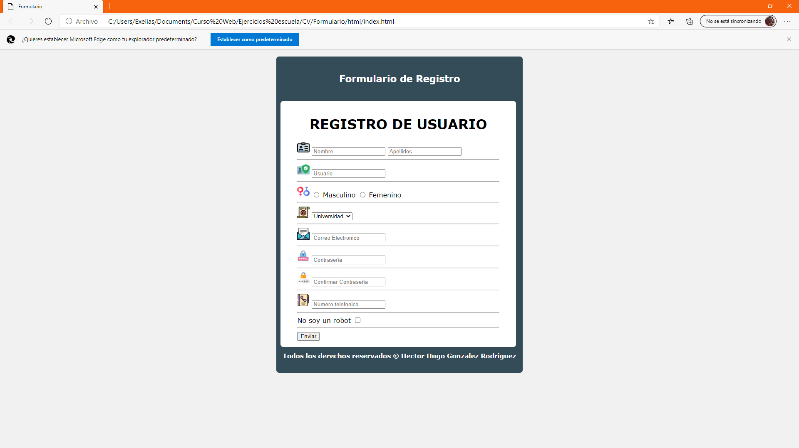

# Practica 02. Formulario
## Lenguajes de marcado

 ### Para poder hacer esta practice hize uso de HTML junto a CSS, e inclui iconos y algunas validaciones en las cajas de texto para su mejor presentacion.
 
## Head

## CSS (Agrupacion de selectores)

# Captura de pantallas en diferentes navegadores para poder comprobar la compatibilidad con estos mismos

## Efectos de  validacion (required )en el area de los textfield

## *Google Chrome*

## *Opera*

## *Brave Software (nativo)*

## *Edge*

